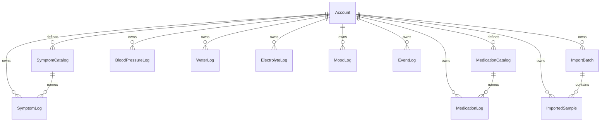

# Data Model

[[00-overview|← Overview]]

> [!important] This document is a design contract
> Migrations/schema in the codebase must implement what is written here. A
> schema change starts by editing this document, then updating the code to
> match. If code and this document disagree, the code is wrong or this
> document was skipped — fix whichever happened.

## Scope
Covers v1: accounts/auth credentials references, manual log entries, name catalogs (symptom + medication), and imported Apple Health / CSV / XML samples in Turso. Deferred: edit-in-place for manual logs, multi-timezone users, clinician/share tables (never).

## Global conventions
- **Primary keys:** opaque string IDs (ULID or UUID) — exact generator chosen at scaffold; consistent across tables.
- **Account scoping:** every health row has `account_id`; queries always filter by the authenticated account.
- **Timezone:** canonical zone is **`America/New_York`**. All log and import sample timestamps are **stored and displayed** as America/New_York wall-clock times (not per-user zones). Imported timestamps are normalized into this zone on ingest.
- **Timestamps on rows:** `created_at` for row insertion (same zone convention); event time fields use names like `recorded_at`.
- **Manual logs v1:** **create + delete only** (no update/edit).
- **Electrolytes:** at most one row per `(account_id, calendar_date)` in America/New_York; enforce in DB (unique constraint) and UI.
- **Import dedupe:** on ingest, **skip duplicates**. Dedupe key: `(account_id, metric_key, recorded_at, value)` (same metric, time, and value for the same account = duplicate).
- **Enums:** mood values fixed: `awful` | `not_great` | `okay` | `good` | `great`. Electrolyte rows are **taken = yes only** (v1 has no create-no UI; absence of a row for that day = not taken). Symptom **severity** fixed: `usual` | `worse_than_usual` | `better_than_usual` (UI labels: Normal amount / Worse than usual / Better than usual — `usual` storage key unchanged).
- **Symptom name / medication name:** chosen from per-account **catalog** dropdowns. For v1, catalogs are **fixed/seeded** (no in-app add-name UX). Seed lists below.

## Decision log (binding)
| # | Decision | Choice | Rationale |
| --- | --- | --- | --- |
| 1 | Timezone | America/New_York store + display | Owner location; single-user primary |
| 2 | Manual log mutation | Delete-only (no edit) in v1 | Owner Define answer |
| 3 | Re-import | Skip duplicates | Avoid double-counting trends |
| 4 | Symptom / med names | Dropdown from catalogs | Consistent labeling for analytics |
| 5 | Dedupe key | account + metric_key + recorded_at + value | Stable skip rule for CSV/XML/zip |
| 6 | Severity scale | usual / worse_than_usual / better_than_usual | Owner Define |
| 7 | Catalog mutability | Fixed seeded lists in v1 (no add-name UI) | Owner Define |
| 8 | Auth population | Laura + Demo seeded; no public registration | Owner Define |
| 9 | Blood pressure source | Manual log only; never Apple Health / import | Grill-me 2026-08-10 |
| 10 | BP posture | Never capture lying/sitting/standing | Grill-me 2026-08-10 |
| 13 | Import pair | Both summary + detailed CSV required; reject if either missing | Grill-me 2026-08-10 |
| 14 | Import history / delete | One `ImportBatch` **per file**; pair upload creates two batches sharing `pair_id`; delete removes one file’s batch + samples only | Owner + Figma 62946:4447 (FEAT-009 grill) |

## v1 seeded catalogs (binding)
### Symptom names
Fatigue, Dizzy, Lightheaded, Nauseous, Syncope, Joint Pain, Joint Stiffness

### Medication names
Midodrine, Propranolol, Claritin, Adderall XR, Magnesium Glycinate, Gabapentin, Celecoxib, Metoclopramide, Tirzepatide, Vitamin D

### Seeded accounts
Exactly two accounts, **created by seed/migration** (no public self-registration in v1): **Laura** (owner) + **Demo** (test). **Demo starts with no health logs/imports** (symptom/med catalogs may still be seeded). Usernames recorded in [[07-credentials]]; passwords only in secrets/env — never plaintext in this vault.

## Entities

### Account
| Column | Type | Constraints | Notes |
| --- | --- | --- | --- |
| id | text | PK | |
| username | text | unique, not null | Login identifier (not email-required) |
| password_hash | text | not null | Never store plaintext |
| created_at | text/datetime | not null | America/New_York convention |

### SymptomCatalog
| Column | Type | Constraints | Notes |
| --- | --- | --- | --- |
| id | text | PK | |
| account_id | text | FK → Account, not null | Per-account list |
| name | text | not null; unique per account | Dropdown label |
| created_at | text/datetime | not null | |

### MedicationCatalog
| Column | Type | Constraints | Notes |
| --- | --- | --- | --- |
| id | text | PK | |
| account_id | text | FK → Account, not null | |
| name | text | not null; unique per account | Dropdown label |
| created_at | text/datetime | not null | |

### SymptomLog
| Column | Type | Constraints | Notes |
| --- | --- | --- | --- |
| id | text | PK | |
| account_id | text | FK, not null | |
| symptom_catalog_id | text | FK → SymptomCatalog, not null | Name via catalog |
| severity | text | not null | `usual` \| `worse_than_usual` \| `better_than_usual` |
| notes | text | nullable | Optional |
| recorded_at | text/datetime | not null | America/New_York |
| created_at | text/datetime | not null | |

### BloodPressureLog
| Column | Type | Constraints | Notes |
| --- | --- | --- | --- |
| id | text | PK | |
| account_id | text | FK, not null | |
| systolic | int | not null | mmHg |
| diastolic | int | not null | mmHg |
| heart_rate | int | not null | count/min at measurement |
| recorded_at | text/datetime | not null | |
| created_at | text/datetime | not null | |

### MedicationLog
| Column | Type | Constraints | Notes |
| --- | --- | --- | --- |
| id | text | PK | |
| account_id | text | FK, not null | |
| medication_catalog_id | text | FK → MedicationCatalog, not null | |
| dose | text | not null | Free-text dose (e.g. "10 mg") unless later constrained |
| recorded_at | text/datetime | not null | |
| created_at | text/datetime | not null | |

### WaterLog
| Column | Type | Constraints | Notes |
| --- | --- | --- | --- |
| id | text | PK | |
| account_id | text | FK, not null | |
| amount_oz | real/int | not null, > 0 | |
| recorded_at | text/datetime | not null | Daily total = sum for calendar date |
| created_at | text/datetime | not null | |

### ElectrolyteLog
| Column | Type | Constraints | Notes |
| --- | --- | --- | --- |
| id | text | PK | |
| account_id | text | FK, not null | |
| taken | bool or enum | not null | Always **yes** for stored rows in v1 (create-no not offered) |
| recorded_at | text/datetime | not null | |
| calendar_date | text (date) | not null | America/New_York date; **UNIQUE (account_id, calendar_date)** |
| created_at | text/datetime | not null | |

### MoodLog
| Column | Type | Constraints | Notes |
| --- | --- | --- | --- |
| id | text | PK | |
| account_id | text | FK, not null | |
| mood | text | not null | awful \| not_great \| okay \| good \| great |
| recorded_at | text/datetime | not null | |
| created_at | text/datetime | not null | |

### EventLog
| Column | Type | Constraints | Notes |
| --- | --- | --- | --- |
| id | text | PK | |
| account_id | text | FK, not null | |
| note | text | not null | Textarea body |
| recorded_at | text/datetime | not null | |
| created_at | text/datetime | not null | |

### ImportBatch
One row **per imported file**. A successful pair upload (REQ-12) inserts **two** batches that share the same `pair_id`.

| Column | Type | Constraints | Notes |
| --- | --- | --- | --- |
| id | text | PK | |
| account_id | text | FK, not null | |
| pair_id | text | not null | Shared by the detailed + summary rows from one upload |
| source_format | text | not null | `detailed_csv` \| `summary_csv` |
| original_filename | text | nullable | Display name on history card |
| status | text | not null | `completed` \| `processing` \| `failed` |
| imported_at | text/datetime | not null | |
| created_at | text/datetime | not null | |

### ImportedSample
| Column | Type | Constraints | Notes |
| --- | --- | --- | --- |
| id | text | PK | |
| account_id | text | FK, not null | |
| import_batch_id | text | FK → ImportBatch, not null | Samples belong to **one file** batch |
| metric_key | text | not null | Stable key from metric contract (see below) |
| value | real | not null | Numeric value in contract unit |
| unit | text | not null | min, %, count/min, ms, hr, count, mi |
| recorded_at | text/datetime | not null | Normalized to America/New_York |
| created_at | text/datetime | not null | |
| | | **UNIQUE (account_id, metric_key, recorded_at, value)** | Skip duplicates on conflict |

### Import `metric_key` values (binding)
Driven by third-party **detailed** CSV `Metric` column (see [[01-requirements]] + `fixtures/import/`).

| metric_key | Export `Metric` (detailed) | Unit |
| --- | --- | --- |
| heart_rate | heart_rate | bpm |
| resting_heart_rate | resting_heart_rate | bpm |
| walking_heart_rate_average | walking_heart_rate_avg | bpm |
| heart_rate_variability | hrv_sdnn | ms |
| step_count | steps | count |
| walking_running_distance | distance_walking_running | mi |
| apple_exercise_time | exercise_minutes | min |
| active_energy | active_energy | kcal |
| basal_energy | basal_energy | kcal |
| flights_climbed | flights_climbed | count |

Summary CSV daily columns may add further keys at import FEAT (sleep, SpO2, respiratory, etc.) without changing the detailed keys above.

**Removed from v1 import model:** heart_rate_min / heart_rate_max / heart_rate_avg as separate Apple aggregate types; native zip/XML ingest.

## Client-side storage (if any)
None required for durable health data — Turso is source of truth. Session cookie only on the client (no health payloads in localStorage).
